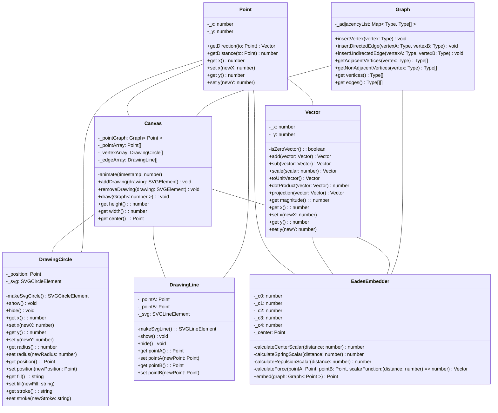

# Class diagram

```mermaid
classDiagram

class EadesEmbedder {
	-_c0: number
	-_c1: number
	-_c2: number
	-_c3: number
	-_c4: number
	
	-_center: Point
	
	-calculateCenterScalar(distance: number) number
	-calculateSpringScalar(distance: number) number
	-calculateRepulsionScalar(distance: number) number
	-calculateForce(pointA: Point, pointB: Point, scalarFunction: (distance: number) => number) Vector
	+embed(graph: Graph< Point >) Point
}

class Graph {
	-_adjacencyList: Map< Type, Type[] >
	
	+insertVertex(vertex: Type) void
	+insertDirectedEdge(vertexA: Type, vertexB: Type) void
	+insertUndirectedEdge(vertexA: Type, vertexB: Type) void
	+getAdjacentVertices(vertex: Type) Type[]
	+getNonAdjacentVertices(vertex: Type) Type[]
	+get vertices() Type[]
	+get edges() Type[][]
}

class Canvas {
	-_pointGraph: Graph< Point >
	-_pointArray: Point[]
	-_vertexArray: DrawingCircle[]
	-_edgeArray: DrawingLine[]

	-animate(timestamp: number)
	+addDrawing(drawing: SVGElement) void
	+removeDrawing(drawing: SVGElement) void
	+draw(Graph< number >): void
    +get height(): number
	+get width(): number
	+get center(): Point
}

class Point {
	-_x: number
	-_y: number
	
	+getDirection(to: Point) Vector
	+getDistance(to: Point) number
	+get x() number
	+set x(newX: number)
	+get y() number
	+set y(newY: number)
}

class Vector {
	-_x: number
	-_y: number
	
	-isZeroVector(): boolean
	+add(vector: Vector) Vector
	+sub(vector: Vector) Vector
	+scale(scalar: number) Vector
	+toUnitVector() Vector
	+dotProduct(vector: Vector) number
	+projection(vector: Vector) Vector
	+get magnitude(): number
	+get x(): number
	+set x(newX: number)
	+get y(): number
	+set y(newY: number)
}

class DrawingCircle {
	-_position: Point
	-_svg: SVGCircleElement

	-makeSvgCircle() SVGCircleElement
	+show() void
	+hide() void
	+get x(): number
	+set x(newX: number)
	+get y(): number
	+set y(newY: number)
	+get radius(): number
	+set radius(newRadius: number)
	+get position(): Point
	+set position(newPosition: Point)
	+get fill(): string
	+set fill(newFill: string)
	+get stroke(): string
	+set stroke(newStroke: string)
}

class DrawingLine {
	-_pointA: Point
	-_pointB: Point
	-_svg: SVGLineElement
	
	-makeSvgLine(): SVGLineElement
	+show() void
	+hide() void
	+get pointA(): Point
	+set pointA(newPoint: Point)
	+get pointB(): Point
	+set pointB(newPoint: Point)
}

Canvas -- DrawingCircle
Canvas -- DrawingLine
Point -- EadesEmbedder
Point -- Canvas
Point -- DrawingCircle
Point -- DrawingLine
Point -- Vector
Vector -- EadesEmbedder
Canvas -- EadesEmbedder
Graph -- Canvas
Graph -- EadesEmbedder
```
