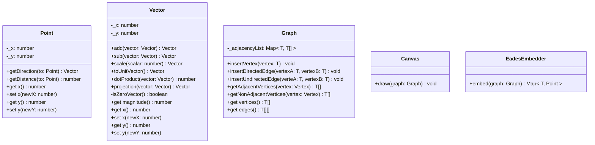

```mermaid
classDiagram
class Point{
	-_x: number
	-_y: number

	+getDirection(to: Point) Vector
	+getDistance(to: Point) number
	+get x() number
	+set x(newX: number)
	+get y() number
	+set y(newY: number)
}

class Vector {
	-_x: number
	-_y: number

	+add(vector: Vector) Vector
	+sub(vector: Vector) Vector
	+scale(scalar: number) Vector
	+toUnitVector() Vector
	+dotProduct(vector: Vector) number
	+projection(vector: Vector) Vector
	-isZeroVector() boolean
	+get magnitude() number
	+get x() number
	+set x(newX: number)
	+get y() number
	+set y(newY: number)
}

class Graph {
	-_adjacencyList: Map< T, T[] >

	+insertVertex(vertex: T) void
	+insertDirectedEdge(vertexA: T, vertexB: T) void
	+insertUndirectedEdge(verteA: T, vertexB: T) void
	+getAdjacentVertices(vertex: Vertex) T[]
	+getNonAdjacentVertices(vertex: Vertex) T[]
	+get vertices() T[]
	+get edges() T[][]
}

class Canvas {
	+draw(graph: Graph<T>) void
}

class EadesEmbedder {
	+embed(graph: Graph<T>) Map< T, Point >
}

```
